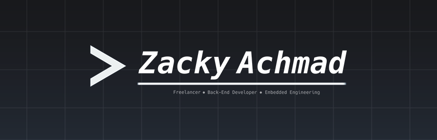

<!-- Header -->
<a href="https://s.id/zckyachmd">
  <picture>
    <source srcset="./cover.png" />
    
  </picture>
</a>

<br />
<br />

<!-- Badge -->
<header>
  <div align="center">
    <a href="https://s.id/zacky" target="_blank">
      
    </a>
    <a href="https://s.id/zacky-linkedin" target="_blank">
      
    </a>
    <a href="https://s.id/zacky-x" target="_blank">
      
    </a>
  </div>
</header>

<br />

<!-- GPG Public Key -->
<details>
  <summary>📬 Want to keep things secret?</summary>

```shell
# Import my public key (hi@zacky.id)
curl -sL https://raw.githubusercontent.com/zckyachmd/zckyachmd/main/gpg-hi@zacky.id-pubkey.asc | gpg --import
```

Or grab it manually:

🔗 [Download](./gpg-hi@zacky.id-pubkey.asc) · 🔎 [keys.openpgp.org](https://keys.openpgp.org)

Fingerprint: `3729 A8B9 ACEE 610E 9EB8 9DDE 4D7C C46F 49E4 E952`

</details>
